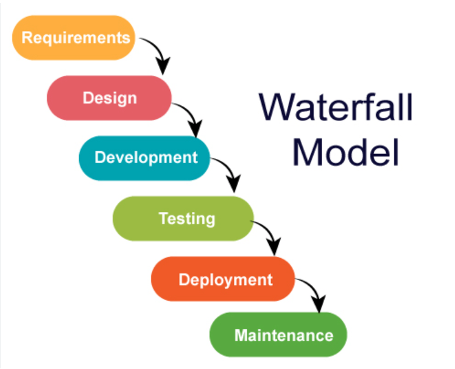
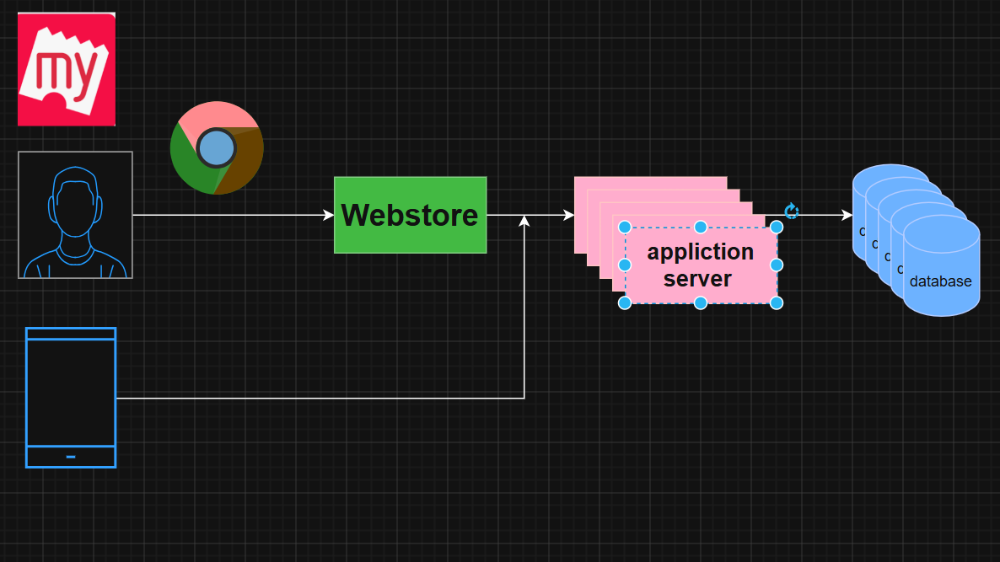
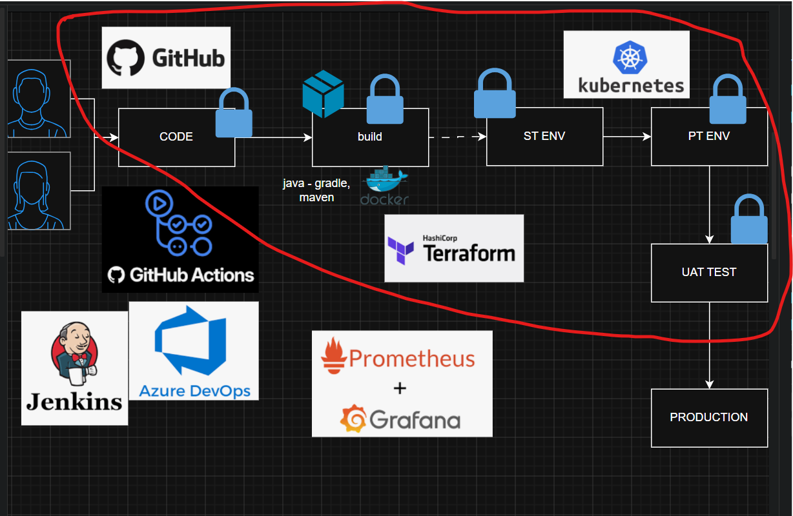
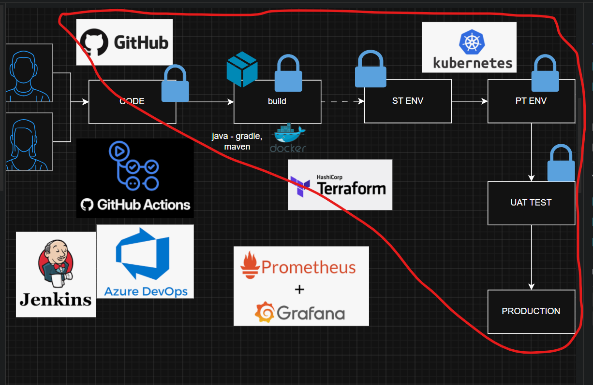
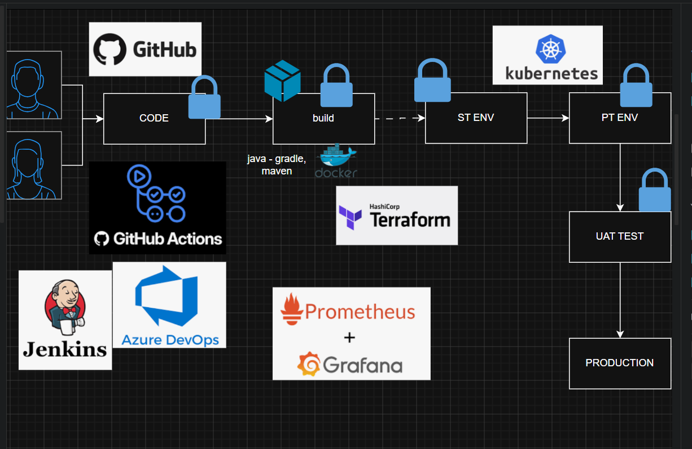

## Software Engineering - 5000 ft overview.
* GUI 
* Command line interface

* How much will you rate out of 10, running your windows system? 

    * Playground(windows)
* windows has designed command line interface 
     * Based on
        * **Verb - Noun** 
            * Get-command
            * Stop-Process 
            * Get-Executionpolicy 
            * Get-Alias -> it will show all the alias commands.
* In windows to install any software packages,
    * we have a tool called **Package Manger**
        * winget 
            * winget --version -> To check the version

## install softwares 
* notepad++ 
* terminal -> powershell as prior
* visual studio code 
* GitBash ( supports linux commands in windows)

## windows hacks 
* To open explorer from terminal use **start** 
* To open vscode from terminal use **code**

#### NOTE: 
* if you want to open current directory give the location as `.`

* for example
```bash 
start . # To open windows file explorer
code .  # To open vscode
```
* For macos - **Homebrew** is the Package Manager.

----
## College project looks

* 5 people.
* went home 
* after 15 days come to college.  
* and trying combine the project. 
    * output will not work
    * It looks like waterfall model

## SDLC
* In 1970 
    * waterfall



* **Agile**
    * sprint (2 weeks)
    * everyweeks they are going validate
    * everday stand up calls 

* for example friday 6 pm developer has submitted 
    * operations - deploy it 
    * testers - test 

* DevOps (Developer + Operations)

* CICD 

### How applictaion runs




### for storing code/source code 

* centralised system (older)
* Github/Gitlab 

* when developer has given **PULL REQUEST** that's where cicd starts.


* ci - continuous integration 
* cd - continuous Deployment




* continuous Delivery 



## overview of flow 



## exercise: 

* windows package manger - install softwares and try
* freshers - github account 

