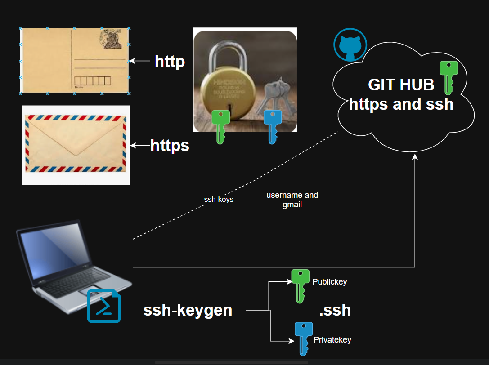

# How to connect with Github account 

* Git and Github
    * Git is Version Control System
    * GitHub is webbased source code store
    * GitHub Actions 🤔




###  https and ssh 
* For secure communication we are going use https. 
* for secure connection we are going to SSH. 
* configure gmail and username
* copy publickey of your system to github

```bash 
git config --global user.mail "gmail.com"
git congig --global user.name "username"
```

* for https
    * username 
    * PAT - Personal access token

* prompt
```
You are an expert in Git and Github, 
i have created github repo in Github account, i want to clone it to my system and add somefiles and push to Github.
i am beginner can you guide clearly.
```

### servers for application
* physical severs/on-prem
* virtual machine
* cloud server 

### Let's create a server in cloud 
* first login to the server
```bash 
ssh <username>@<publicIP>
```
* let's install webserver
    * httpd/apache
    * nginx 

* webserver has a default document root directory
    * /var/www/html 
#### watch classroom recording for deploying sample webpage. 

[refer here](https://templatemo.com/tm-622-clearwave#google_vignette) for sampel html page

* java
* python 
* Dotnet
* react/angular

## How to deploy java application

[Refer Here](https://github.com/spring-projects/spring-petclinic)

* in ubuntu server 
    * create folder `mkdir practice` 
        * `cd practice` 
    * `git clone https://github.com/spring-projects/spring-petclinic.git`

* To build packge for java application
    * we need java compiler - JDK
    * we need maven 


